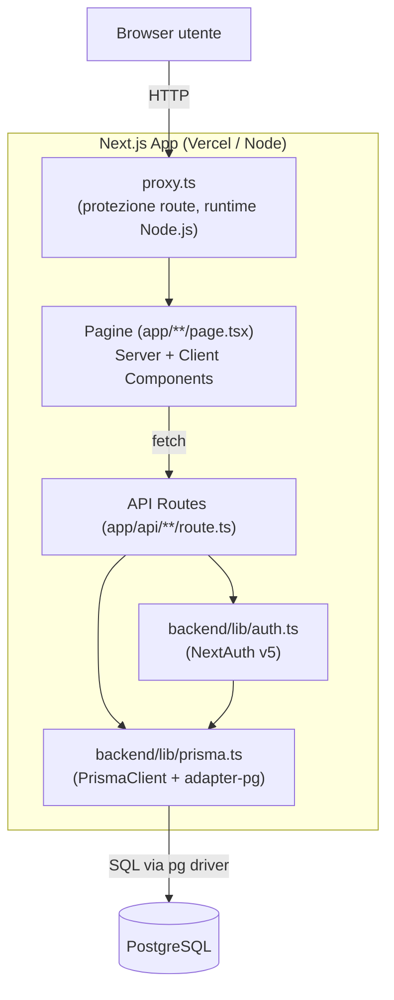
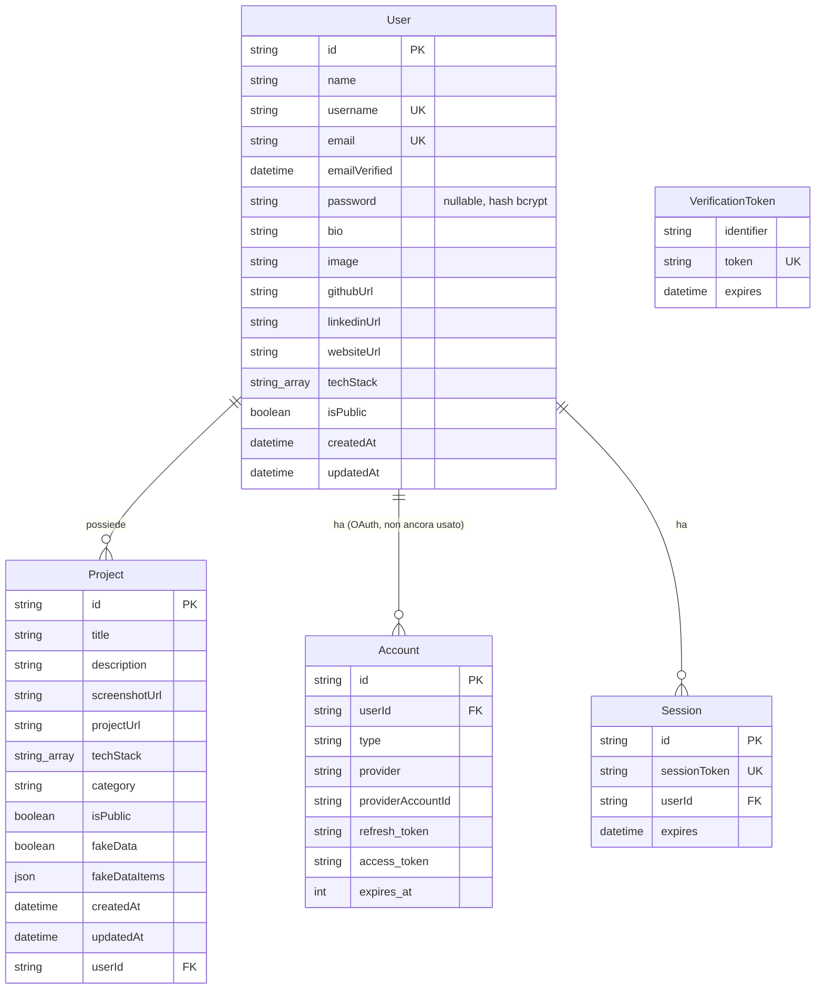

# Documento di Architettura e Design (SAD) — DevShelf

Codice progetto: DVS-2026-01 · Versione: 1.0 · Data: 2026-07-01

---

## 1. Architettura di Sistema

### 1.1 Pattern architetturale

DevShelf adotta un'architettura **monolitica full-stack** basata su **Next.js App Router**, con separazione logica (non fisica) tra frontend e backend:

- **Frontend**: Server e Client Component React, renderizzati da Next.js. I Client Component (`"use client"`) gestiscono stato e interattività (form, wizard, modali); il resto è statico/server-rendered.
- **Backend**: Route Handler di Next.js (`app/api/**/route.ts`) che espongono endpoint REST. Non c'è un server backend separato: gira nello stesso processo Node del frontend, sia in sviluppo (`next dev`) sia in produzione (`next start` o funzioni serverless su Vercel).
- **Persistenza**: PostgreSQL, accesso esclusivamente tramite **Prisma ORM** (nessuna query SQL raw nel codice applicativo).

Questo pattern è spesso chiamato **"Next.js monolith"** o **BFF implicito** (Backend-for-Frontend): un solo deploy, un solo repository, ma con confini di codice netti (cartelle `backend/` e `frontend/`, vedi `README.md` principale) che replicano la separazione logica che avrebbe un'architettura a due servizi.

**Perché non microservizi:** il progetto ha un solo team/sviluppatore e un dominio applicativo piccolo (utenti + progetti); la complessità operativa di più servizi (orchestrazione, comunicazione di rete, deploy multipli) non sarebbe giustificata dal carico o dalla dimensione del dominio.

### 1.2 Diagramma dei componenti

### 1.3 Stack tecnologico

| Layer | Tecnologia |
|-------|-----------|
| Frontend | Next.js 16 (App Router), React 19, Tailwind CSS 4, Framer Motion |
| Backend | Next.js Route Handlers, Zod (validazione) |
| Autenticazione | NextAuth.js 5 (JWT, Credentials Provider) |
| ORM / Data access | Prisma 7 + `@prisma/adapter-pg` |
| Database | PostgreSQL 16 |
| Hosting previsto | Vercel (app) + Neon/Supabase (DB gestito) — vedi `manuale-sviluppatore.md` §12 |
| Dev environment | Docker (Postgres locale) |

---

## 2. Modellazione dei Dati

### 2.1 Diagramma Entità-Relazione

`Account`, `Session`, `VerificationToken` sono le tabelle standard richieste dall'adapter Prisma di NextAuth — non fanno parte del dominio applicativo di DevShelf in senso stretto, ma sono necessarie per la gestione di sessioni/provider OAuth. `VerificationToken` è inoltre riusata applicativamente per i token di reset password (vedi `manuale-sviluppatore.md` §7).

### 2.2 Dizionario dei dati

**User**

| Campo | Tipo | Vincoli | Descrizione |
|-------|------|---------|-------------|
| id | String (cuid) | PK | Identificativo univoco |
| name | String | obbligatorio | Nome completo |
| username | String | unique, obbligatorio | Usato nell'URL pubblico `/profile/[username]` |
| email | String | unique, obbligatorio | Usata per login |
| emailVerified | DateTime? | nullable | Riservato al flusso NextAuth (non attivo per Credentials) |
| password | String? | nullable | Hash bcrypt (salt rounds 12); null se l'utente arriva da OAuth |
| bio | String? | nullable, max 300 char (validato in API) | Biografia breve |
| image | String? | nullable | URL immagine profilo |
| githubUrl / linkedinUrl / websiteUrl | String? | nullable, validati come URL | Link social |
| techStack | String[] | default `[]`, max 20 (validato in API) | Tecnologie dichiarate dall'utente |
| isPublic | Boolean | default `true` | Se `false`, il profilo pubblico restituisce 404 |
| createdAt / updatedAt | DateTime | automatici | Timestamp |

**Project**

| Campo | Tipo | Vincoli | Descrizione |
|-------|------|---------|-------------|
| id | String (cuid) | PK | Identificativo univoco |
| title | String | obbligatorio, max 100 char | Titolo progetto |
| description | String? | nullable, max 500 char | Descrizione |
| screenshotUrl | String? | nullable, URL | Immagine mostrata nella Browser Card |
| projectUrl | String? | nullable, URL | Link al progetto reale |
| techStack | String[] | default `[]`, max 10 | Tecnologie usate nel progetto |
| category | String? | nullable | Una delle categorie del wizard (Web App, App Mobile, ecc. — non vincolata a livello DB) |
| isPublic | Boolean | default `false` | Se `true`, appare sul profilo pubblico e in Esplora |
| fakeData | Boolean | default `false` | Attiva il banner "dati fittizi" nel Browser Modal |
| fakeDataItems | Json? | nullable, non ancora popolato da nessuna UI | Riservato a una futura lista dettagliata di sostituzioni (es. `[{ "type": "email", "value": "..." }]`, vedi `analisi-progetto.md` §8) |
| userId | String | FK → User.id, `onDelete: Cascade` | Proprietario |
| createdAt / updatedAt | DateTime | automatici | Timestamp |

**Account / Session** — schema standard `@auth/prisma-adapter`, non documentato ulteriormente qui (vedi [documentazione NextAuth Prisma Adapter](https://authjs.dev/reference/adapter/prisma)).

**VerificationToken**

| Campo | Tipo | Vincoli | Descrizione |
|-------|------|---------|-------------|
| identifier | String | — | Email dell'utente (riuso applicativo: identifica il proprietario del token di reset) |
| token | String | unique | Token casuale (`crypto.randomBytes(32)`), uso singolo |
| expires | DateTime | — | Scadenza (1 ora dalla generazione per i token di reset password) |

---

## 3. Specifiche API

Specifica machine-readable completa in [`docs/openapi.yaml`](./openapi.yaml) (formato OpenAPI 3.0, importabile in Swagger UI / Postman / Insomnia).

Riepilogo:

| Metodo | Endpoint | Auth | Request body | Response 200/201 |
|--------|----------|:---:|---------------|-------------------|
| POST | `/api/auth/register` | – | `{ name, username, email, password }` | `{ id, name, username, email }` |
| GET / POST | `/api/auth/[...nextauth]` | – | gestito da NextAuth | sessione / redirect |
| POST | `/api/auth/forgot-password` | – | `{ email }` | `{ message, devResetUrl? }` (messaggio sempre generico, link solo perché non c'è un servizio email reale) |
| POST | `/api/auth/reset-password` | – | `{ email, token, password }` | `{ message }` |
| GET | `/api/projects` | ✓ | – | `Project[]` (solo dell'utente autenticato) |
| POST | `/api/projects` | ✓ | `{ title, description?, screenshotUrl?, projectUrl?, techStack?, category?, isPublic?, fakeData? }` | `Project` |
| GET | `/api/projects/{id}` | ✓ | – | `Project` |
| PUT | `/api/projects/{id}` | ✓ | stessi campi di POST | `Project` aggiornato |
| DELETE | `/api/projects/{id}` | ✓ | – | `{ success: true }` |
| GET | `/api/profile/me` | ✓ | – | `User` (senza password) |
| PUT | `/api/profile/me` | ✓ | `{ name?, bio?, image?, githubUrl?, linkedinUrl?, websiteUrl?, techStack?, isPublic? }` | `User` aggiornato |
| DELETE | `/api/profile/me` | ✓ | – | `{ success: true }` — elimina l'utente e, in cascata, i suoi Project/Account/Session |
| GET | `/api/profile/{username}` | – | – | `User & { projects: Project[] }` (solo se `isPublic`, altrimenti 404) |
| GET | `/api/explore?tech=&page=` | – | – | `{ users: UserCard[], total, page, limit }` |

**Convenzioni comuni:**
- Autenticazione: sessione JWT letta lato server con `auth()` (NextAuth); nessun header custom, il cookie di sessione è gestito automaticamente dal browser.
- Errori: sempre `{ "error": string }` con status HTTP appropriato — `400` (validazione Zod fallita), `401` (non autenticato), `403` (autenticato ma non proprietario della risorsa), `404` (risorsa non trovata o non pubblica), `500` (errore generico).
- Validazione input: sempre con **Zod** prima di toccare il database.

---

## 4. Decisioni architetturali rilevanti

| Decisione | Alternativa scartata | Motivazione |
|-----------|----------------------|--------------|
| Un solo repo Next.js (FE+BE nello stesso processo) | Backend separato (Express/Fastify) + frontend statico | Dominio piccolo, team ridotto; Next.js Route Handlers coprono già i bisogni REST senza un secondo servizio da deployare/mantenere |
| Prisma + driver adapter (`@prisma/adapter-pg`) | Query engine binario integrato (default nelle versioni Prisma < 7) | Prisma 7 lo richiede; vantaggio collaterale: bundle più leggero, driver Postgres standard riutilizzabile per query raw future |
| Sessioni JWT (non database session) | Session store su DB | Stateless, adatto a deploy serverless (Vercel) senza sticky session |
| Cartelle `backend/`/`frontend/` invece di `lib/`/`components/` generiche | Struttura piatta Next.js di default | Confini di codice espliciti (vedi `backend/README.md`/`frontend/README.md`): a colpo d'occhio si capisce se un file è logica server o UI |
| `proxy.ts` (runtime Node.js) invece di `middleware.ts` (runtime Edge, legacy) | Middleware su Edge Runtime | Obbligato: il driver `pg` usato da Prisma non gira su Edge Runtime (mancano le API Node native); `proxy.ts` è la convenzione Next.js 16 con Node.js come runtime di default |
| Eliminazione account tramite `onDelete: Cascade` a livello di schema | Cancellazione manuale riga per riga nell'API route | Garantisce che non si possano dimenticare tabelle collegate (Project, Account, Session) in futuro se il modello dati cresce; coerente col requisito GDPR "diritto alla cancellazione" della SRS |
