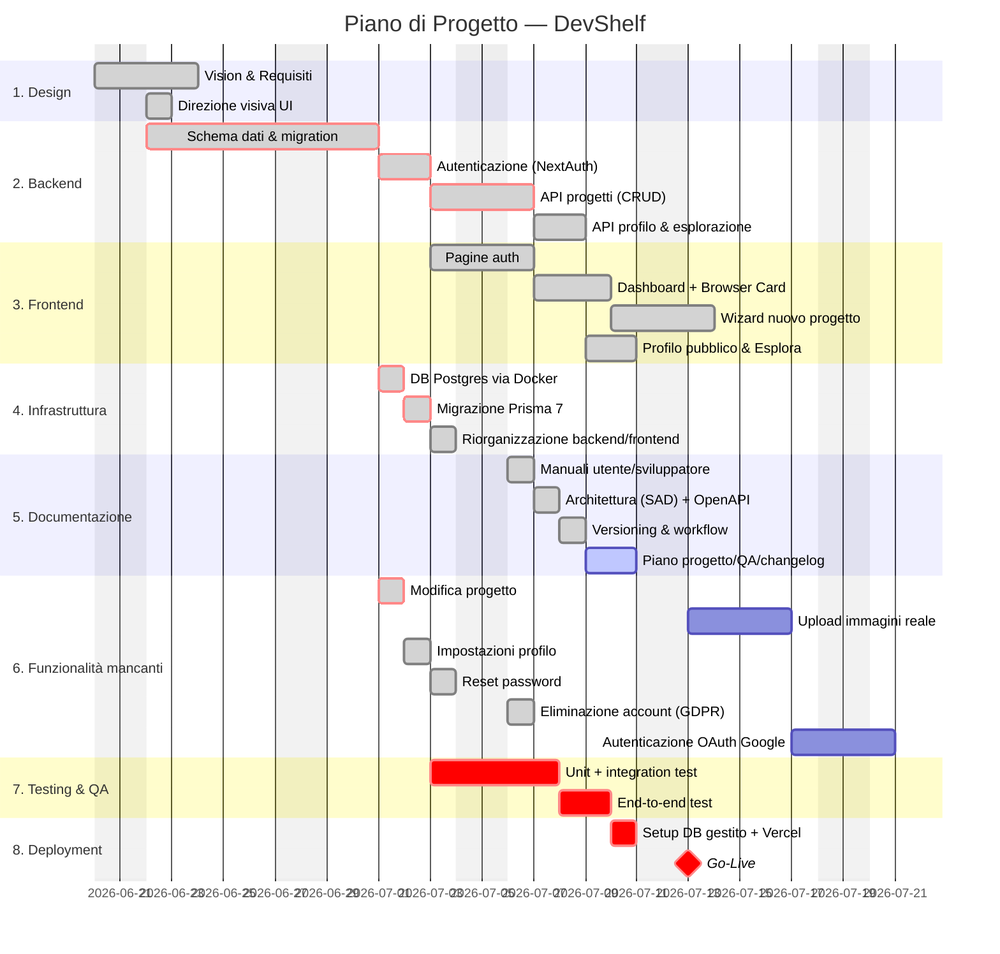

# Piano di Progetto e Tempistiche — DevShelf

Codice progetto: DVS-2026-01 · Versione: 1.0 · Data: 2026-07-01

Le fasi fino a oggi (2026-07-01) sono consuntivate sulla base della cronologia Git effettiva; le fasi successive sono pianificate.

---

## 1. WBS (Work Breakdown Structure)

```
DevShelf
├── 1. Design & Definizione
│   ├── 1.1 Documento di Visione
│   ├── 1.2 Documento dei Requisiti (SRS)
│   └── 1.3 Direzione visiva UI (mockup Browser Card / Browser Modal)
├── 2. Sviluppo Backend
│   ├── 2.1 Schema dati (Prisma) e migration
│   ├── 2.2 Autenticazione (NextAuth, Credentials)
│   ├── 2.3 API progetti (CRUD)
│   └── 2.4 API profilo ed esplorazione
├── 3. Sviluppo Frontend
│   ├── 3.1 Pagine auth (login/registrazione)
│   ├── 3.2 Dashboard + Browser Card/Modal
│   ├── 3.3 Wizard nuovo progetto
│   └── 3.4 Profilo pubblico + Esplora
├── 4. Infrastruttura & Dati
│   ├── 4.1 Database Postgres locale (Docker)
│   ├── 4.2 Migrazione a Prisma 7 (driver adapter)
│   └── 4.3 Riorganizzazione codice (backend/ e frontend/)
├── 5. Documentazione
│   ├── 5.1 Manuale utente e sviluppatore
│   ├── 5.2 Architettura (SAD) + OpenAPI
│   ├── 5.3 Versioning & workflow
│   └── 5.4 Piano di progetto, QA, changelog (questo documento e successivi)
├── 6. Funzionalità mancanti (backlog)
│   ├── 6.1 Modifica progetto (`/projects/[id]/edit`)
│   ├── 6.2 Pannello impostazioni profilo
│   ├── 6.3 Upload immagini reale (Uploadthing)
│   ├── 6.4 Reset password
│   ├── 6.5 Eliminazione account (GDPR)
│   └── 6.6 Autenticazione OAuth (Google)
├── 7. Testing & QA
│   ├── 7.1 Unit test (funzioni pure, validazione Zod)
│   ├── 7.2 Integration test (API + DB)
│   └── 7.3 End-to-end test (flussi critici)
└── 8. Deployment
    ├── 8.1 Setup DB gestito (Neon/Supabase)
    ├── 8.2 Setup progetto Vercel + variabili ambiente
    └── 8.3 Go-Live
```

---

## 2. Diagramma di Gantt



> Diagramma renderizzato automaticamente da GitHub/GitLab (supporto nativo Mermaid nei file `.md`). In alternativa, incollare il blocco in [mermaid.live](https://mermaid.live) per l'esportazione come immagine.

---

## 3. Milestone

| Milestone | Data prevista | Criterio di completamento |
|-----------|----------------|----------------------------|
| **M1 — Requisiti approvati** | 2026-06-24 (consuntivato) | Vision + SRS completi e condivisi |
| **M2 — MVP funzionante** | 2026-07-01 (consuntivato) | Auth, CRUD progetti, profilo pubblico, esplorazione tutti funzionanti su DB reale |
| **M3 — Documentazione completa** | 2026-07-03 (pianificato) | Tutte le 8 sezioni della consegna presenti in `docs/` |
| **M4 — Feature complete** | 2026-07-15 (pianificato) | Backlog di §1.6 chiuso (modifica progetto ✅, impostazioni profilo ✅, reset password ✅, eliminazione account ✅, upload reale, OAuth Google) |
| **M5 — QA superata** | 2026-07-20 (pianificato) | Criteri di accettazione di `docs/piano-di-testing.md` soddisfatti |
| **M6 — Go-Live** | 2026-07-21 (pianificato) | Deploy in produzione su Vercel + DB gestito |

---

## 4. Allocazione delle risorse

Progetto a team ridotto (coerente con la matrice RACI del Documento di Visione): gli stessi ruoli possono essere ricoperti dalla stessa persona.

| Attività (WBS) | Ruolo responsabile |
|-----------------|---------------------|
| 1. Design & Definizione | Product Owner + Team di sviluppo |
| 2. Sviluppo Backend | Team di sviluppo (focus backend) |
| 3. Sviluppo Frontend | Team di sviluppo (focus frontend) |
| 4. Infrastruttura & Dati | Team di sviluppo (focus DevOps/DB) |
| 5. Documentazione | Project Manager + Team di sviluppo |
| 6. Funzionalità mancanti | Team di sviluppo |
| 7. Testing & QA | Team di sviluppo (idealmente con revisione incrociata, non chi ha scritto la feature) |
| 8. Deployment | Team di sviluppo (focus DevOps) |

**Colli di bottiglia da monitorare:** le attività 3 (Frontend) dipendono dal completamento delle rispettive API in 2 (Backend) — se un solo sviluppatore copre entrambi i ruoli in sequenza, il tempo totale è la somma, non il massimo; con più persone, backend e frontend di una stessa area (es. "Dashboard" e "API progetti") possono procedere in parallelo solo dopo che il contratto dati (schema + shape delle risposte API) è stato concordato.

---

## 5. Percorso Critico (Critical Path)

Attività marcate `crit` nel Gantt — un ritardo su una qualsiasi di queste sposta la data di **Go-Live**:

```
Schema dati & migration → Autenticazione → API progetti (CRUD)
  → DB Postgres via Docker → Migrazione Prisma 7
  → Modifica progetto → Unit/Integration test → End-to-end test
  → Setup DB gestito + Vercel → Go-Live
```

Le attività **non** sul percorso critico (es. "Upload immagini reale") hanno margine (slack): un ritardo contenuto non impatta la data finale, ma sono comunque necessarie per la milestone M4 (Feature complete).
